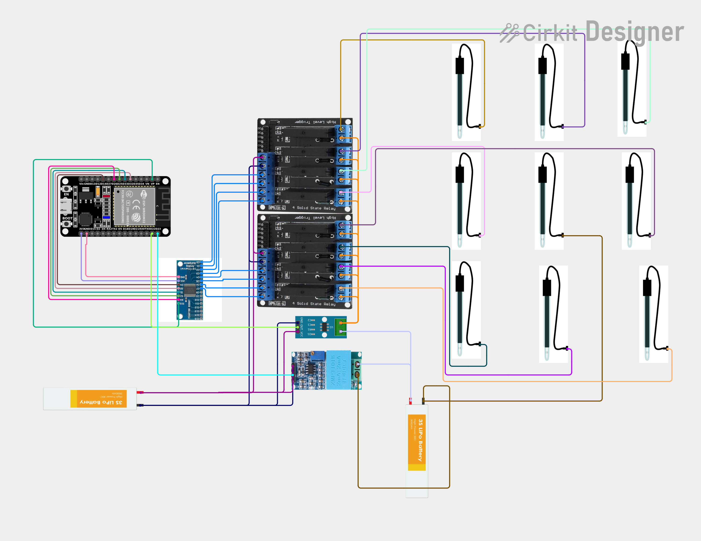

# Multi-Electrode Resistivity Tomography and Landslide Alert System

**Author**: Mohit Choudhary  
**Department**: Electrical Engineering, National Institute of Technology, Hamirpur  
**Email**: 22BEE073@nith.ac.in  

---

## Project Overview
This project presents an innovative and cost-effective multi-electrode resistivity meter integrated with a landslide alert system. By employing electrical resistivity tomography (ERT), the system continuously monitors soil properties, such as resistivity, moisture content, and vibrations, which are critical indicators of landslide susceptibility. A network of electrodes controlled by ESP32 microcontrollers transmits real-time data to a server, providing early warnings via a web-based interface and alert mechanisms.

---

## Key Features
1. **Multi-Electrode Resistivity Mapping**: Automated resistivity measurements using an 8-electrode setup with one reference electrode.
2. **Early Warning System**: Alerts through sirens and a website when critical resistivity values are detected.
3. **Real-Time Data Visualization**: Displays soil resistivity, moisture, and vibration data on a web interface.
4. **Cost-Effective Design**: Utilizes readily available components such as ESP32, DHT22, ZMPT101B, and ACS712 sensors.
5. **Adaptability**: Configurable for various electrode configurations (e.g., Wenner, Wenner-Schlumberger).
6. **Data Integration**: Sends data to ThingSpeak for processing and visualization.

---

## Technologies Used
- **Microcontroller**: ESP32 and Arduino Nano
- **Sensors**: ZMPT101B (Voltage), ACS712 (Current), DHT22 (Moisture), MPU6050 (Vibration)
- **Web Interface**: Real-time data visualization and alerts
- **Communication Protocol**: MQTT
- **Data Processing**: ThingSpeak for resistivity mapping
- **Power Circuitry**: Switching mode boost converter
- **Software**: Arduino IDE, ThingSpeak API, Web Server Integration

---

## Circuit Diagram
  

---

## Getting Started
### Prerequisites
- ESP32 microcontroller
- Sensors (listed in the "Technologies Used" section)
- Relay module for electrode switching
- Soil sample for testing
- Access to ThingSpeak or equivalent IoT platform

### Installation Steps
1. Assemble the hardware as per the circuit diagram.
2. Flash the ESP32 with the provided Arduino code.
3. Set up the ThingSpeak channel and configure the API keys in the code.
4. Deploy the website for real-time visualization.

---

## Contribution
Feel free to open an issue or submit a pull request to enhance the project!

---

## License
This project is licensed under the MIT License. See the LICENSE file for details.

---

## Acknowledgments
- Team contributions and guidance from faculty at NIT Hamirpur.
- References to scientific papers on ERT techniques and landslide monitoring.
